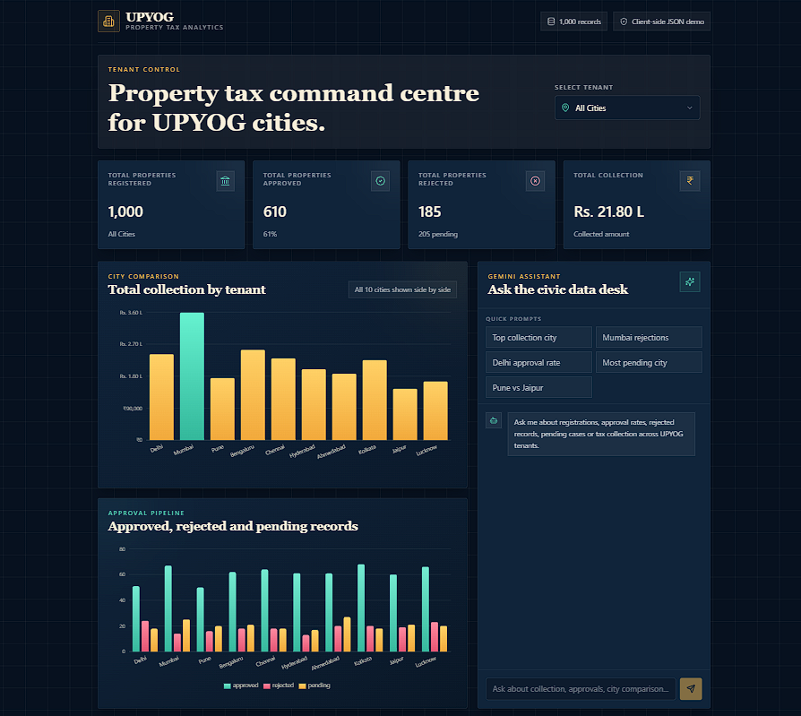
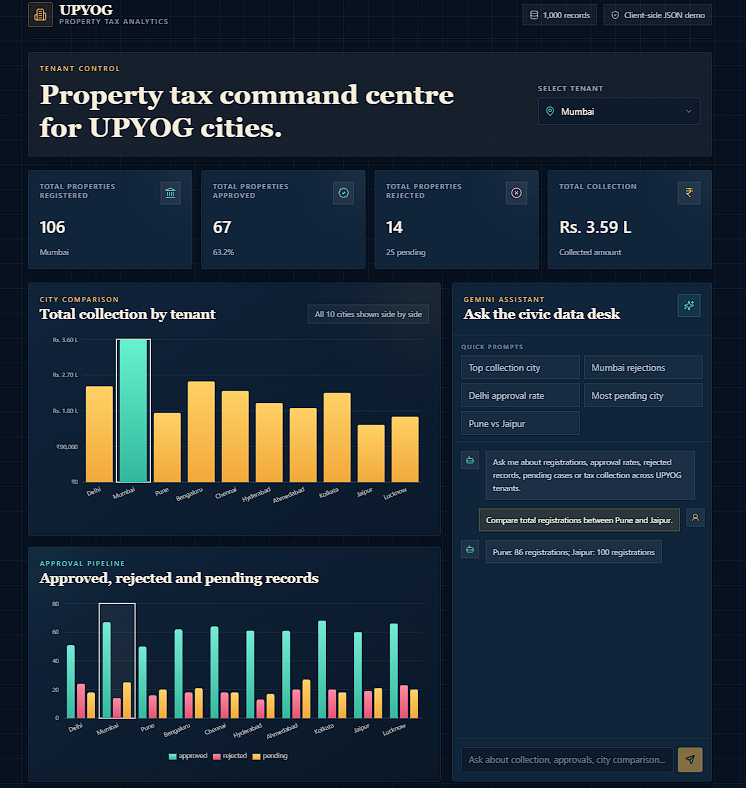

# UPYOG Property Tax Analytics Dashboard

React + Vite dashboard for the NUDM UPYOG intern assessment. The app loads `properties.json` directly in React, computes tenant-wise property tax KPIs, renders comparison charts, and includes a Gemini-powered chat assistant.

## Screenshots

### Dashboard Overview



### Tenant Filter, Highlighted Charts and AI Chat



## Features

- Tenant filter with `All Cities` plus the 10 required city tenants.
- KPI cards for total registered, approved, rejected, and total collection. Values update live from the selected tenant.
- Recharts comparison views for total collection and approval pipeline status.
- Gemini chat assistant with deterministic local answers for the assessment sample questions.
- Client-side Gemini rate guardrails for request spacing, rough token limits, and daily demo usage.
- Playwright e2e tests covering KPI correctness, tenant filtering, city chart labels, chat answers, and chat scroll behavior.

## Rubric Coverage

| Component | Max Points | Project Coverage |
| --- | ---: | --- |
| KPI dashboard | 30 | Four cards compute directly from `src/data/properties.json` |
| Tenant filter | 15 | Dropdown includes `All Cities` and all 10 tenants; KPIs update live |
| Comparison chart | 10 | Total collection bar chart plus grouped Approved/Rejected/Pending chart |
| AI chat assistant | 25 | Gemini API with dataset summary context, local deterministic answers for sample questions, Markdown rendering |
| Code quality and structure | 10 | Modular `components`, `services`, `utils`, `constants`, and `types` |
| README and setup | 10 | Bun setup, env setup, build, preview, and test instructions |

## Setup

Install dependencies with Bun:

```powershell
bun install
```

Create a `.env` file from `.env.example`:

```env
VITE_GEMINI_API_KEY=your_key_here
VITE_GEMINI_MODEL=gemini-2.5-flash
```

The dataset is at:

```text
src/data/properties.json
```

Run locally:

```powershell
bun run dev
```

Build for submission:

```powershell
bun run build
```

Preview the production build:

```powershell
bun run preview
```

Run e2e tests:

```powershell
bun run test:e2e
```

## Gemini Notes

This assessment calls Gemini directly from the Vite frontend for demo simplicity. In production, move Gemini calls behind a backend or serverless proxy so the API key is not exposed in browser JavaScript or Network requests.

Gemini model names and quotas can change. The default model is configurable through `VITE_GEMINI_MODEL`, and request limits should be confirmed in Google AI Studio for the active project.

## Sample Questions

- Give me a short insight summary of property tax performance across all tenants.
- How many properties are rejected in Mumbai?
- What percentage of Delhi properties are approved?
- Which city has the most pending properties?
- Compare total registrations between Pune and Jaipur.
